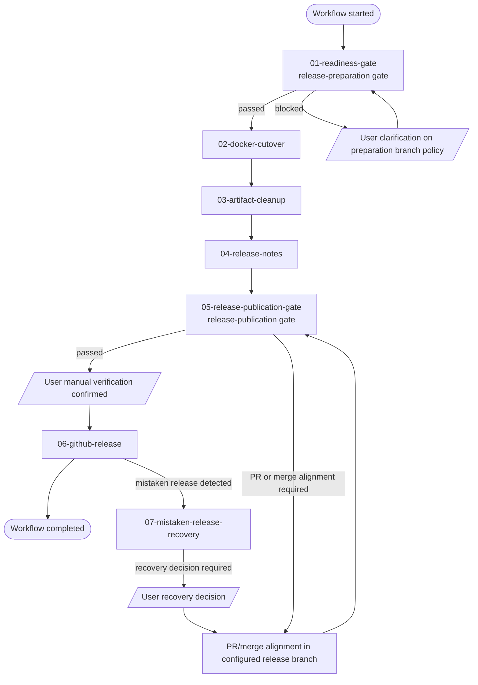

# Workflow: release проекта

## Назначение workflow

Этот workflow описывает последовательность шагов release после завершения taskset, канонизации знаний в SoT и готовности проекта к упаковке и публикации.

Для подключения workflow pack в конкретный проект используй [`setup_instructions.md`](./setup_instructions.md).
Workflow-local terms смотри в [`terms.md`](./terms.md).

## Preconditions

- relevant taskset выполнен;
- knowledge уже поднято в project SoT;
- release-ready scope определен;
- project-local release binding прочитан из `project/releaseContext.md`.

## Execution scope

- Не учитывай место хранения workflow artifacts при определении execution scope.
- Этот workflow выполняется для корневого проекта, который запускает release workflow.
- Reusable workflow semantics живут в этом файле и в `STEP.md`/`SKILL.md` step packs.
- Project-specific release shape, repository boundaries и release rules должны читаться из `project/` и workflow-instance artifacts в `operational_scope/realise_project/`.

## Workflow-instance exchange layer

Этот workflow использует временный workflow-specific exchange layer внутри `Operational Documentation Layer`.

Baseline путь:

- `operational_scope/realise_project/`

Рекомендуемая materialization для конкретного прогона:

- `operational_scope/realise_project/<release-id>/`

В этом слое хранятся только instance-specific handoff artifacts между шагами workflow. После завершения workflow они могут быть удалены.

## Graph overview

## Таблица вершин

| Vertex | Type | Meaning |
| --- | --- | --- |
| `Workflow started` | lifecycle marker | Вход в workflow run |
| `01-readiness-gate` | workflow-step | Проверка readiness и `release-preparation gate` |
| `User clarification on preparation branch policy` | user interaction | Явное подтверждение/уточнение branch situation перед продолжением workflow |
| `02-docker-cutover` | workflow-step | Preparation-stage Docker/release contour |
| `03-artifact-cleanup` | workflow-step | Cleanup completed operational artifacts |
| `04-release-notes` | workflow-step | Preparation release notes |
| `05-release-publication-gate` | workflow-step | Explicit publication eligibility decision |
| `User manual verification confirmed` | user interaction | Human confirmation, что release contour вручную проверен перед publication |
| `06-github-release` | workflow-step | Final git/GitHub release publication |
| `07-mistaken-release-recovery` | workflow-step | Exception/remediation path after mistaken release |
| `User recovery decision` | user interaction | Human decision for remediation path, version reuse/bump or other corrective choice |
| `Workflow completed` | lifecycle marker | Нормальное завершение happy path |

## Таблица переходов

| From | To | Condition |
| --- | --- | --- |
| `Workflow started` | `01-readiness-gate` | workflow run started |
| `01-readiness-gate` | `02-docker-cutover` | `release-preparation gate` passed |
| `01-readiness-gate` | `User clarification on preparation branch policy` | preparation policy blocked |
| `User clarification on preparation branch policy` | `01-readiness-gate` | user clarification received |
| `02-docker-cutover` | `03-artifact-cleanup` | step completed |
| `03-artifact-cleanup` | `04-release-notes` | step completed |
| `04-release-notes` | `05-release-publication-gate` | release-preparation stage completed |
| `05-release-publication-gate` | `User manual verification confirmed` | `release-publication gate` passed and human verification required |
| `User manual verification confirmed` | `06-github-release` | manual verification confirmed |
| `05-release-publication-gate` | `PR/merge alignment in configured release branch` | publication policy not yet satisfied |
| `PR/merge alignment in configured release branch` | `05-release-publication-gate` | corrective alignment completed |
| `06-github-release` | `Workflow completed` | publication succeeded |
| `06-github-release` | `07-mistaken-release-recovery` | mistaken release detected |
| `07-mistaken-release-recovery` | `User recovery decision` | remediation requires human decision |
| `User recovery decision` | `PR/merge alignment in configured release branch` | remediation decision taken |

## Happy path steps

1. [Readiness Gate](./01-readiness-gate/STEP.md)
2. [Docker Cutover](./02-docker-cutover/STEP.md)
3. [Artifact Cleanup](./03-artifact-cleanup/STEP.md)
4. [Release Notes](./04-release-notes/STEP.md)
5. [Release Publication Gate](./05-release-publication-gate/STEP.md)
6. [GitHub Release](./06-github-release/STEP.md)

## Exception/remediation step

7. [Mistaken Release Recovery](./07-mistaken-release-recovery/STEP.md)

## Базовая последовательность

- Сначала пройти [`release-preparation gate`](./terms.md), включая branch matrix и preparation-stage branch policy.
- Затем подготовить release Docker contour и зафиксировать новые release versions для touched units.
- После этого очистить completed operational artifacts, уже поднятые в SoT.
- Затем подготовить release notes для root проекта и changed nested release units.
- После завершения `release-preparation stage` пройти [`release-publication gate`](./terms.md) как explicit workflow-step и только затем выполнять финальный publication contour.
- В конце materialize-ить git tags и GitHub releases для root repo и changed nested release units по версиям из `project/releaseVersionRegistry.json`.

## Vacancies and handoff model

| Step | Preferred vacancy | Static context source | Additional handoff required |
| --- | --- | --- | --- |
| `01-readiness-gate` | preferably the same Architect | `AGENTS.md`, `project/`, `docs/`, completed task reports | none; step initializes `release-run.md`, fixes touched release units, branch matrix and first step handoff itself |
| `02-docker-cutover` | Code-agent | `AGENTS.md`, `project/`, `docs/` | [`01-readiness-gate-handoff.md`](../../../../operational_scope/realise_project/<release-id>/01-readiness-gate-handoff.md) + current [`release-run.md`](../../../../operational_scope/realise_project/<release-id>/release-run.md); must include approved release scope, touched release units, exclusions, previous version baseline, proposed next release version/tag, compose sync intent |
| `03-artifact-cleanup` | preferably the same Architect | `AGENTS.md`, `project/`, `docs/`, completed task reports | [`01-readiness-gate-handoff.md`](../../../../operational_scope/realise_project/<release-id>/01-readiness-gate-handoff.md) + [`02-docker-cutover-handoff.md`](../../../../operational_scope/realise_project/<release-id>/02-docker-cutover-handoff.md) + current [`release-run.md`](../../../../operational_scope/realise_project/<release-id>/release-run.md); must include approved scope, deleted/unchanged release units, SoT baseline confirmation |
| `04-release-notes` | preferably the same Architect | `AGENTS.md`, `project/`, `docs/`, completed task reports | [`03-artifact-cleanup-handoff.md`](../../../../operational_scope/realise_project/<release-id>/03-artifact-cleanup-handoff.md) + current [`release-run.md`](../../../../operational_scope/realise_project/<release-id>/release-run.md); must include final retained/deleted artifact picture and approved release scope |
| `05-release-publication-gate` | Code-agent | `AGENTS.md`, `project/`, `docs/` | [`04-release-notes-handoff.md`](../../../../operational_scope/realise_project/<release-id>/04-release-notes-handoff.md) + current [`release-run.md`](../../../../operational_scope/realise_project/<release-id>/release-run.md); must include changed release units, branch matrix, publication-policy inputs, PR/merge evidence |
| `06-github-release` | Code-agent | `AGENTS.md`, `project/`, `docs/` | [`05-release-publication-gate-handoff.md`](../../../../operational_scope/realise_project/<release-id>/05-release-publication-gate-handoff.md) + current [`release-run.md`](../../../../operational_scope/realise_project/<release-id>/release-run.md) + `project/releaseVersionRegistry.json`; must include changed release units, release-note paths, fixed release versions/tags, explicit exclusions |
| `07-mistaken-release-recovery` | Code-agent | `AGENTS.md`, `project/`, `docs/` | [`06-github-release-handoff.md`](../../../../operational_scope/realise_project/<release-id>/06-github-release-handoff.md) + `mistaken-release-recovery.md` + current [`release-run.md`](../../../../operational_scope/realise_project/<release-id>/release-run.md); must include invalid publication state and remediation decision |

### Почему шаги `01`, `03`, `04` prefer the same Architect

Эти шаги требуют continuity of understanding:

- как проектировались планы;
- как решения были канонизированы в SoT;
- как implementation reports соотносятся с изначальным design intent;
- какие operational artifacts уже безопасно удалять;
- как корректно синтезировать release notes без semantic drift.

Поэтому vacancy здесь должен закрывать preferably тот же самый Architect, который вел planning -> canonization -> implementation review cycle.

### Что получает Code-agent и чего ему не хватает

На шагах `02`, `05`, `06`, `07` Code-agent получает из `AGENTS.md` и `project/` static project context:

- repo boundaries;
- release units;
- release note locations;
- compose boundaries;
- stable Docker naming and current version registry;
- cleanup/tagging policy.

Но этого недостаточно для конкретного release-instance. Ему не хватает:

- approved release-instance scope;
- exact changed release units этого прогона;
- release-instance exclusions;
- compose-sync intent, уже одобренного на readiness step;
- mapping release notes к changed release units;
- result of version bump decision for touched units before GitHub release step.

Поэтому для шагов `02`, `05`, `06`, `07` обязателен explicit handoff через workflow-specific exchange layer.

## Важные invariants

- Workflow не должен сам по себе публиковать release до manual verification пользователем.
- Workflow должен различать `release-preparation gate` и `release-publication gate`.
- Workflow должен различать preparation-stage branch policy и publication-stage branch policy.
- Workflow не должен публиковать release artifacts из branch, который не проходит project-local publication policy.
- Workflow должен допускать project-local preparation flow до `release-publication gate`.
- Workflow должен читать branch policy, release units, documentation locations, atomicity и recovery rules из project-local context, а не хардкодить их в reusable layer.
- `project/releaseVersionRegistry.json` является текущим mutable registry release versions/tags для root проекта и nested release units.
- Cleanup не должен удалять неканонизированное знание.
- Release notes и tags должны готовиться только для touched release units.
- Workflow-specific exchange layer живет в `Operational Documentation Layer` и не подменяет ни Engineering Documentation SoT, ни Release Documentation Layer.
